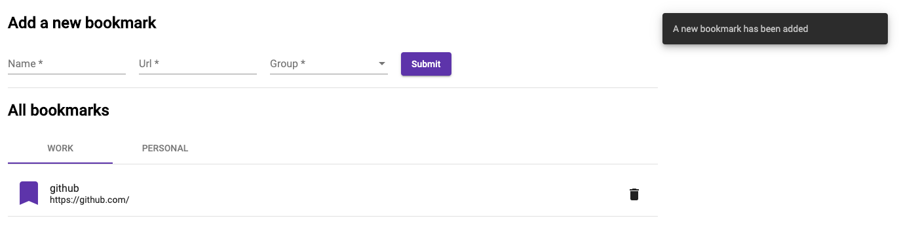

# Bookmarks

This web-application allows a user to manage a bookmark list. The user can add a new bookmark, view a list of all bookmarks grouped by group property, delete any bookmark from an existing list.

The first section of the app is a form where a user can add a new bookmark.
Each bookmark has 3 required fields. They are the name, the url and the group.
There are three groups. The group list is static intentionally because there is no requirement/description how the user should manage the bookmark group list.
Empty list with invalid form

Added first bookmark

In the second section the user can see all bookmarks which grouped by the group field. Grouping implemented by tabs. Each tab displays bookmarks from corresponding group.

The user is able to delete any bookmark. The user has to confirm deletion to prevent unintentionally action.

## Development server

Run `ng serve` for a dev server. Navigate to `http://localhost:4200/`. The app will automatically reload if you change any of the source files.

## Build

Run `ng build` to build the project. The build artifacts will be stored in the `dist/` directory. Use the `--prod` flag for a production build.

## Running unit tests

Run `ng test` to execute the unit tests via [Karma](https://karma-runner.github.io).
